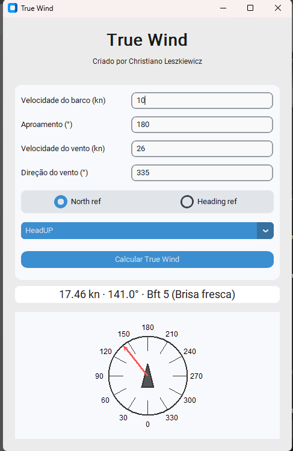

# True Wind

A desktop app to calculate and visualize True Wind, built with CustomTkinter.



## PT-BR

### Descrição
Calculadora de Vento Real (True Wind) com interface gráfica em CustomTkinter. Informe a velocidade e o aproamento do barco, e a velocidade e direção do vento medidos. O app calcula a magnitude e direção do Vento Real e exibe um indicador gráfico com modos de exibição NorthUP e HeadUP.

### Recursos
- Cálculo do Vento Real a partir de vento aparente e velocidade/rumo do barco
- Escala de Beaufort automática com descrição em português
- Alternância entre referência de vento ao Norte ou ao Aproamento
- Visualização gráfica com modos NorthUP e HeadUP

### Requisitos
- Python 3.9+
- Dependencies: `customtkinter`

### Como executar
```bash
python TrueWind.py
```

### Como gerar executável (Windows)
Este projeto já possui um arquivo `TrueWind.spec` para PyInstaller.

```bash
# usando uv para instalar dependências
uv pip install -r requirements.txt

# gerar exe com PyInstaller
pyinstaller TrueWind.spec
```
O executável será gerado em `dist/TrueWind.exe`.

### Notas de uso
- "North ref" usa Norte verdadeiro como referência da direção do vento.
- "Heading ref" soma o aproamento do barco à direção do vento medida.
- "NorthUP" mantém o Norte no topo da rosa; "HeadUP" gira a rosa e mantém o barco para cima.

---

## EN

### Description
A True Wind calculator with a CustomTkinter GUI. Enter boat speed and heading, plus measured wind speed and direction. The app computes True Wind speed and direction and renders a visual indicator with NorthUP and HeadUP view modes.

### Features
- True Wind computation from apparent wind and boat speed/heading
- Automatic Beaufort scale with Portuguese labels
- Toggle between wind reference to North or to Heading
- Graphic visualization with NorthUP and HeadUP modes

### Requirements
- Python 3.9+
- Dependencies: `customtkinter`

### How to run
```bash
python TrueWind.py
```

### How to build executable (Windows)
This project ships with a `TrueWind.spec` for PyInstaller.

```bash
# using uv to install deps
uv pip install -r requirements.txt

# build exe with PyInstaller
pyinstaller TrueWind.spec
```
The binary will be in `dist/TrueWind.exe`.

### Usage notes
- "North ref" uses true North as wind reference.
- "Heading ref" adds boat heading to the measured wind direction.
- "NorthUP" keeps North at the top; "HeadUP" rotates the rose to keep the boat facing up.

---

## License

This project is distributed under a permissive license that requires preserving the attribution "Criado por Christiano" in the UI and/or source code. See [LICENSE](./LICENSE).

